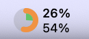
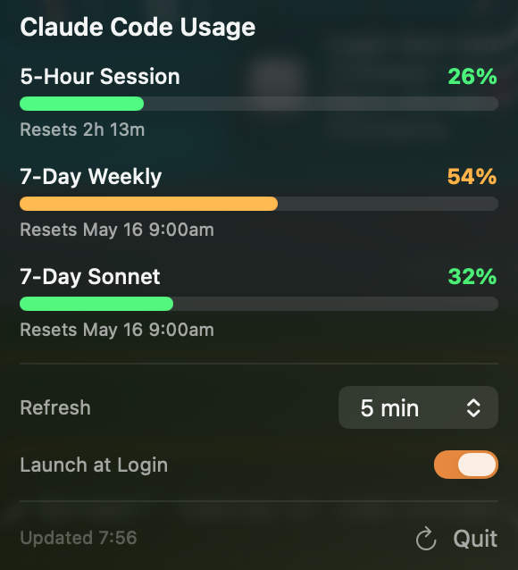

# QuotaMenu

**「AIコーディング中の『使用量制限（クォータ）』をメニューバーからスマートに監視」**

QuotaMenu は、[Claude Code](https://docs.anthropic.com/en/docs/claude-code) や Codex の使用状況を macOS のメニューバーから一目で確認できる常駐型アプリです。
わざわざブラウザを開いたり、ターミナルで確認コマンドを打つことなく、コーディングに集中しながら残りの使用量をいつでもチェックできます。

<p align="center">
  
  &emsp;
  
</p>

---

## ✨ 主な特徴 (Features)

* **メニューバーで常時監視**
  5時間セッションと7日間の週次使用率を「二重のリング（ドーナツチャート）」としてコンパクトに表示。開発の手を止めることなく残量を確認できます。
* **クリックして詳細確認**
  アイコンをクリックするとポップオーバーが開き、正確な残量と次のリセット時刻をプログレスバーでわかりやすく表示します。
* **複数プロバイダの自動検出**
  起動するだけで、インストール・サインイン済みの CLI（Claude Code / Codex）を自動的に検出して並列に表示します。未検出のプロバイダは自動的に非表示になります。
* **安心のローカル処理（読み取り専用）**
  アカウント情報やパスワードを独自に要求することはありません。Mac 内に保存されている認証情報を「安全に読み取るだけ」なので極めて安全です。
* **メニューバーのアダプティブ表示**
  カラフルモード時は、実際のメニューバーの外観（ダーク/ライト）に自動追従して美しいグラフィックを描画します。
* **ログイン時に自動起動**
  Mac の起動時にアプリを自動起動するオプションも提供しています。
* **自動アップデート**
  新しいバージョンが公開されると自動で検知し、確認のうえワンクリックで更新できます（[Sparkle](https://sparkle-project.org/) を使用）。手動で確認したい場合は設定画面の「サポート」タブからいつでもチェックできます。

---

## 🚀 インストール方法 (Installation)

配布用の公開リポジトリは [iyuya1808/quotamenu-dist](https://github.com/iyuya1808/quotamenu-dist) です。DMG、Sparkle の自動アップデート feed、Homebrew Cask はこのリポジトリから配布されます。

### 1. Homebrew からインストール (推奨)
ターミナルを開き、以下のコマンドを実行するだけでインストールできます。

```sh
brew install --cask https://raw.githubusercontent.com/iyuya1808/quotamenu-dist/main/Casks/quotamenu.rb
```

### 2. DMG ファイルから手動インストール
1. GitHub Releases の [最新リリース](https://github.com/iyuya1808/quotamenu-dist/releases/tag/latest) から `QuotaMenu.dmg` をダウンロードします。
2. ダウンロードした DMG ファイルを開き、`QuotaMenu.app` を `/Applications` フォルダにドラッグ＆ドロップしてください。

---

## 💡 使い方と注意点 (Usage & Tips)

### クォータが表示されないときは？
QuotaMenu は、対応する CLI ツールがすでにセットアップされ、サインインしていることを前提としています。表示されない場合は以下を確認してください。

* **Claude Code** — ターミナルで `claude` コマンドが利用でき、すでにログインが完了している必要があります。
* **Codex** — `~/.codex/auth.json` にアクセストークンが保存されている必要があります。

### 自動アップデートについて
QuotaMenu は新しいバージョンが公開されると自動で検知します（バックグラウンドで1日1回チェック）。更新が見つかると確認ダイアログが表示されるので、「インストール」を選ぶだけで最新版に更新できます。すぐに確認したいときは、設定画面の **「サポート」** タブから手動チェックできます。

> Homebrew 経由でインストールした場合は `brew upgrade --cask quotamenu` でも更新できます。

### 情報の反映タイムラグについて
クォータ情報は、各 CLI が API サーバーと通信したタイミングや定期的な更新スケジュールに基づいて取得されます。そのため、実際の使用状況とメニューバーの表示との間に数分程度のタイムラグが発生する場合があります。

### 契約プランによる表示の違い (Plan compatibility)
お使いのプランによって、表示される制限値が自動で切り替わります。

| 制限項目 (Limit Item) | Proプラン | Maxプラン |
|---|---|---|
| 7-Day Weekly usage (7日間週次使用量) | ✓ | ✓ |
| 7-Day Sonnet usage (7日間Sonnet使用量) | ✓ | ✓ |
| 5-Hour Session usage (5時間セッション使用量) | — | ✓ |

※ 5-Hour Session (5時間セッション) の項目は Max プランのみで表示されます（ProプランではAPIがデータを返さないため、そのセクションは自動的に非表示になります）。

---

## 🔒 セキュリティとプライバシー (Security & Privacy)

QuotaMenu はユーザーのプライバシーを最優先に設計されています。

* **読み取り専用**: 独自にログインを実行したり、認証情報を書き換えたりすることはありません。
* **完全ローカル処理**: すべてのデータは Mac 上でローカルに処理されます。認証情報や使用状況の統計が、各プロバイダの公式 API エンドポイント以外のサーバーに送信されることは一切ありません。
* **Claude Code の認証情報**: macOS のキーチェーンに保存された OAuth 認証情報（サービス名 `Claude Code-credentials`）を、macOS標準の安全な仕組みで読み取ります。パスワードの入力プロンプトは不要です。
* **Keychainへのアクセス許可**: 初回起動時や認証情報の読み取りの際に、macOS システムから Keychain へのアクセス許可を求めるダイアログが表示される場合があります。アプリが安全に動作するために、アクセスを「許可」または「常に許可」に設定してください。
* **Codex の認証情報**: `$CODEX_HOME/auth.json` または `~/.codex/auth.json` に保存された access token を読み取ります。

---

## 📄 ライセンスと謝辞 (License & Acknowledgements)

本ソフトウェアは、MITライセンスの下で公開されている [s-age/ccmeter](https://github.com/s-age/ccmeter) (Copyright (c) 2025 s-age) に基づいています。

QuotaMenu への改変およびリブランディングに関する著作権は、Yuya Itonaga (Copyright (c) 2026 Yuya Itonaga) に帰属します。

本プロジェクトは MIT ライセンスの下でライセンスされています。詳細については、[LICENSE](LICENSE) ファイルを参照してください。
